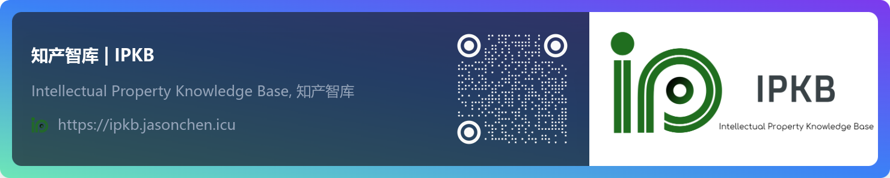

# IPKB 




<p align="center">


</p>

<p align="center">


</p>

---

### What exactly is IPKB

Featuring Intellectual Property Laws and Regulations, IPKB is built specifically for intellectual property practitioners, such as IP attorneys, patent engineers, and IP paralegal assistants. It organizes legal text in a unique way familiar to the industry, and offers approaches to search, locate, index, and reference IP-relevant legal text.

### IPKB is open-source and commercial-free

Empowering IP professionals, IPKB is an open-source platform specifically designed for intellectual property practitioner. While it offers the robust features you need to streamline your workflow, IPKB goes a step further by being completely free to use commercially. 

You can deploy IPKB locally following the steps [below](#steps-to-deploy-ipkb-locally).

### Steps to deploy IPKB locally

IPKB is built using Docusaurus.

**Prerequisites:**

* NodeJS version 20 or later ([NodeJS](https://nodejs.org/))
* `npm` Package Manager (included with NodeJS installation)

**Steps:**

1. **Clone the IPKB repository:**

   ```bash
   git clone https://github.com/n1cogrv/ipkb.git
   cd ipkb
   ```

2. **Install dependencies:**

   ```bash
   npm install
   ```

3. **Start the development server:**

   ```bash
   npm run dev
   ```

   This will start a local development server for IPKB. You can access the platform at `http://localhost:3000` in your web browser.

**Additional Notes:**

* The development server will automatically watch for changes in the code and refresh the browser accordingly.
* To build the project for production deployment and serving it locally, you can run:

   ```bash
   npm run build
   npm run serve
   ```

   This will create an optimized production build in the `build` folder. Please note that some features, such as `search` feature, require IPKB to be run in `PRODUCTION` mode rather than `npm run dev`.

### Contributing to IPKB:

**Contributions are welcomed to IPKB!** 🎉  

If you find any issues or have suggestions for improvement, please [open an issue on GitHub](https://github.com/n1cogrv/ipkb/issues/new).


